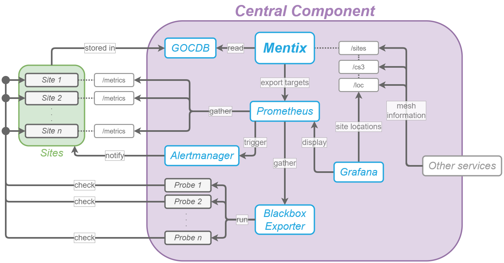

# Health monitoring with the Blackbox Exporter
To monitor the health of each site in the ScienceMesh, a [custom fork](https://github.com/Daniel-WWU-IT/blackbox_exporter) of the [Blackbox Exporter](https://github.com/prometheus/blackbox_exporter) for Prometheus is currently used.

Put simply, the BBE runs a so-called _prober_ to perform a certain check on a provided target when called via URL:
```
https://sciencemesh-test.uni-muenster.de/blackbox/probe?target=google.com&module=nagios_test
```
The response is the result of this check in the form of various Prometheus metrics.

This means that by periodically scraping a BBE target, Prometheus can be used to (indirectly) perform _active probing_ of target sites: Whenever Prometheus calls the BBE target, the BBE in return starts the prober to perform its checks and provides the results in a format consumable by Prometheus. The following diagram illustrates how the BBE is integrated with the central component of the ScienceMesh:



## Nagios probes
Nagios probes can be used to perform checks on specific targets; these can include simple pings, authentication tests or more advanced checks. There are several advantages when using Nagios probes to perform health checks:

- Nagios is widely used, so switching to another system later is easy
- Many Nagios probes exist, so the need to write custom checks is minimized
- No library is necessary to write these probes; in many cases, a probe comes as a simple bash script

Nagios probes do not require a special library to be used. Instead, it follows two simple conventions (we are leaving out support for performance data here, as it is currently not needed in the ScienceMesh project):

- The return code of the probe determines its status:
  - `0` = Success
  - `1` = Warning
  - `2` = Error
  - `3` = Unknown
- The _first_ line of output (to `stdout`) is considered as the probe's status message; any further output is considered as additional information

### Support for Nagios probes in the BBE
The original BBE does not support Nagios probes. This is why a [custom fork](https://github.com/Daniel-WWU-IT/blackbox_exporter) has been created that allows probers of a new `nagios` type that will launch an external Nagios probe and convert its results into Prometheus metrics. More details can be found in above repository.

## How health monitoring works
Here is a brief summary of how health monitoring works:

- The BBE configuration defines Nagios probers that can be used to perform various active checks
- The Prometheus configuration includes a new scrape configuration for every Nagios check that should be run on each site
- Mentix exports a file for Prometheus service discovery that holds a list of all target sites to check
- Prometheus periodically scrapes the BBE target URL and passes the actual site to check; this in return lets the BBE launch the Nagios probe
- The results (in form of metrics) are consumed by Prometheus
- These results can then be further processed by Grafana or other services
